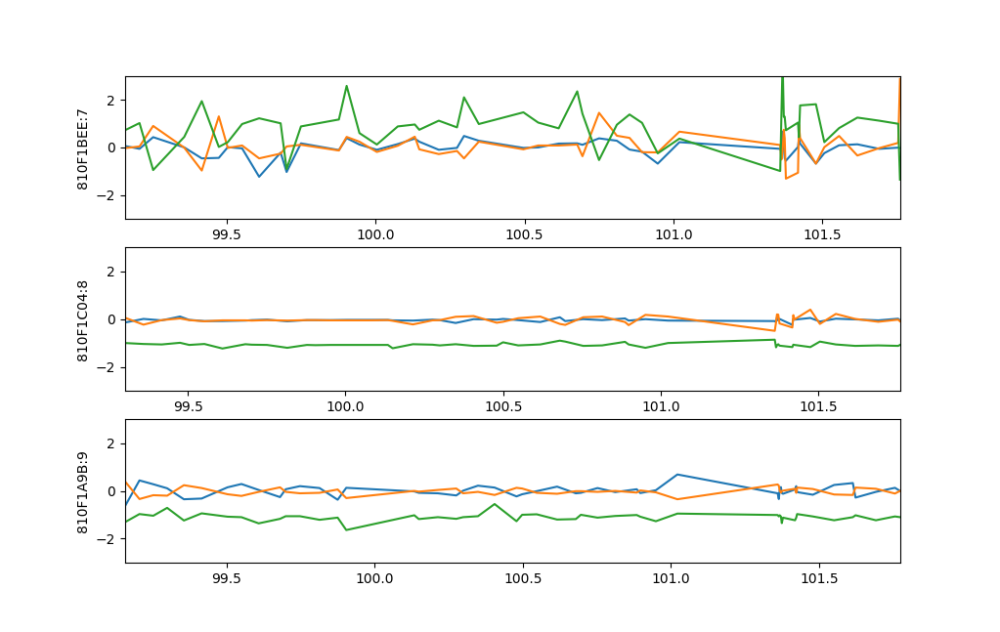

# 2525PUtil
TWELITE 2525A関連のスクリプト

## 準備

### 動作環境
- Python3系

### モジュールのインストール
```sh
pip install -r requirements.txt
```

### USB Portの設定
`port.txt`にportを書き込む

### Portの確認
- Windows
    - デバイスマネージャー>ポート
    - 例：COM*
- MacOS/Linux
    - `ls /dev/`
    - 例：/dev/tty***

## 2525logger
加速度データのロガー．csvに出力する．

### 使い方
```sh
python 2525logger.py
```

## 2525ploter
加速度データのロガー．csvに出力する．


### 使い方
```sh
python 2525ploter.py [--log]
```

### オプション
`--log` : ロギングを行う

